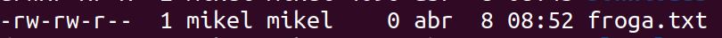
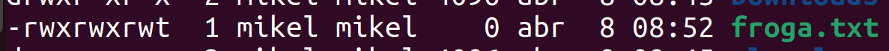
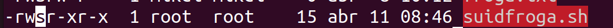
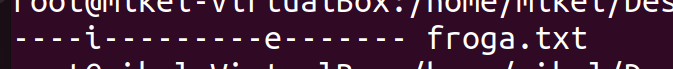
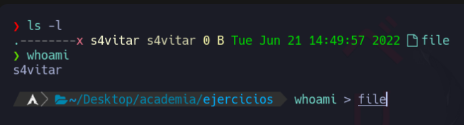
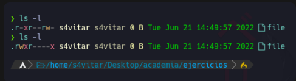
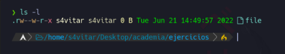

# Baimenak Linux

- [Baimenak Linux](#baimenak-linux)
  - [Fitxategi eta direktorioen baimenak](#fitxategi-eta-direktorioen-baimenak)
    - [Baimen taldeak](#baimen-taldeak)
    - [Baimenak esleitzen modu sinbolikoan](#baimenak-esleitzen-modu-sinbolikoan)
    - [Baimenak modu oktalean](#baimenak-modu-oktalean)
  - [Sticky bit baimena](#sticky-bit-baimena)
  - [SUID eta GUID baimenak](#suid-eta-guid-baimenak)
  - [SUID](#suid)
  - [Ezaugarri bereziak - Isattr eta chattr](#ezaugarri-bereziak---isattr-eta-chattr)
- [Ariketa 1](#ariketa-1)
- [Erantzuna 1](#erantzuna-1)
  - [Ariketa 2](#ariketa-2)
  - [Erantzuna 2](#erantzuna-2)
  - [Ariketa 3](#ariketa-3)
  - [Erantzuna 3](#erantzuna-3)
  - [Ariketa 4](#ariketa-4)
  - [Erantzun 4](#erantzun-4)
  - [Ariketa 5](#ariketa-5)
  - [Erantzuna 5](#erantzuna-5)
  - [Ariketa 6](#ariketa-6)
  - [Erantzuna 6](#erantzuna-6)
  - [Ariketa 7](#ariketa-7)
  - [Erantzuna 7](#erantzuna-7)


## Fitxategi eta direktorioen baimenak

Fitxategi eta direkotorioen baimenak hurrengo aginduarekin ikusi ditzakegu.

```bash
ls -al
```



### Baimen taldeak

- **Jabea (user)**: Fitxategi bat sortzen dugunean, sortzailea jabea izango da defektuz.
- **Talde (group)**: Fitxategi baten jabetza talde bati ere bai dagokio.
- **Besteak (other)**: Jabeak edo taldekideak ez direnak


### Baimenak esleitzen modu sinbolikoan


Bai, hemen dituzu eskatutako informazioa Linuxen baimen motak eta chmod komandoaren erabilera buruz:

Linuxen, fitxategi eta karpeta batzuek hiru baimen mota dituzte: irakurketa (r), idazketa (w) eta exekuzioa (x). Baimen hauek hiru entitateetara aplika daitezke: fitxategiaren jabea, fitxategiak pertenitzen dion taldea eta beste erabiltzaileak.

`chmod` komandoa fitxategi eta karpetaen baimenak aldatzeko erabiltzen da Linuxen. Hemen duzu nola erabiliaren adibide bat:

```bash
chmod baimenak fitxategia_edo_karpeta
```

Non "baimenak" diren baimenak ordezkatzen dituzten letrak edo zenbakiak eta "fitxategia_edo_karpeta" fitxategi edo karpeta izena den.

Adibidez, jabeari (user) exekuzio baimena horrela eman ahal diogu.
```bash
chmod u+x froga.txt
```

Honela, taldeari eta besteei exekuzio eta idazteko baimenak emago dizkiegu.
```bash
chmod go+wx froga.txt
```

Besteei, irakurtzeko baimena horrela kendu diezaiokegu.
```bash
chmod o-r froga.txt
```

### Baimenak modu oktalean

- 0 = 000 = --- = baimanrik gabe
- 1 = 001 = --x = exekuzio baimena
- 2 = 010 = -w- = idazteko baimena
- 3 = 011 = -wx = idazteko eta exetuatzeko baimena
- 4 = 100 = r-- = irakurtzeko baimena
- 5 = 101 = r-x = irakurtzeko eta exekutatzeko baimena
- 6 = 110 = rw- = irakurtzeko eta idazteko baimena
- 7 = 111 = rwx = baimean guztiak

Adibidez baimen guztiak kentzeko
```bash
chmod 000 froga.txt
```

Baimen guztiak gehitzeko 
```bash
chmod 777 froga.txt
```

Erabiltzaileari baimen guztiak emateko eta besteei edo taldekiedei irakurtze eta exekuzio baimenak emateko.
```bash
chmod 755 froga.txt
```

## Sticky bit baimena

Sticky bita daukan fitxategi edo direktorio bat bakarrik jabea edo rootek aldatu ahal dio izena edo ezabatu ahal du.

Stiky bita gehitzeko
```bash
chmod +t froga.txt
```



## SUID eta GUID baimenak

## SUID

SUID aktibatuta dagoenean fitxategi hau exekutatzen duen erabiltzaileak sortazailearen baimenak izango ditu.

```bash
chmod u+s repos
```
sortu exekutable bat hurrengo edukiarekin eta izenarekin

suidfroga.sh
```bash
#!/bin/bash
id
echo $EUID
```
baimenak esleituko dizkiogu fitxategiari
```bash
chmod 755 suidfroga.sh
```


Erabiltazileen baimentan S badago 2775
sticky bita badago  "t" 1755

r-srwx---
570 -> 4570

r--rws---
470 -> 2470

r--rwx--t
470 -> 1470

r--rws--t
470 -> 2470 -> 3470

## Ezaugarri bereziak - Isattr eta chattr

Ezaugarri bereziak ikusteko
`isattr` agindua erabiliko degu

ezaugarri bereziak aldatzeko
`chattr` agindua erabiliko dugu.

- adibidez, "**i**" artributoaren
fitxategi bat inmutablea
bilakatzen dugu.
Ahu naidu ezan inork ezin dula ezabatu, inkluituta root, kentzeko kendu eginbearko zan "i".
```bash
chattr +i froga.txt
isattr froga.txt
```


- "**u**" ezaugarriarekin fitxategi bat ezabatzen dugunean datuak gordeta gelditzen dira eta berreskurapena albiderazten du.
```bash
charttr +u froga.txt
```

- "**e**" ezaugarriarekin, fitxategi bat ezabatzen denean, okupatzen zuen memoria "**0**" kin okupatzen da.

```bash
chattr +e froga.txt
```

- "**c**" ezaugarriarekin fitxategi bat konprimituta egongo da.
  ```bash
  chattr +c froga.txt
  ```
  - "**a**" ezaigarriarekin gitxategi bati bakarrik geitu ahal zaizkio gauzak, ahu da, ezin da aldatu aurretik zegoen ezer.
```bash
chattr +a froga.txt
```
# Ariketa 1

lotu dagokion baimenarekin

- 463
- 123
- 711
- 333
- 161
- 765
- 567
- 101
- 162

- rwx-x-x
- --x-w--wx
- --x-----x
- -wx-wx-wx
- r-xrw-rwx
- rwxrw-r-x
- --xrw--w-
- r--rw--w-
- --xrw---x
# Erantzuna 1
- 463
- 123
- 711
- 333
- 161
- 765
- 567
- 101
- 162

- rwx-x-x = 711
- --x-w--wx = 123
- --x-----x = 101
- -wx-wx-wx = 333
- r-xrw-rwx = 567
- rwxrw-r-x = 765
- --xrw--w- = 162
- r--rw--w- = 462
- --xrw---x = 161

## Ariketa 2
Zein da fitzategi honen baimenen baimena modu oktalean?

## Erantzuna 2
honena baimena modu oktalean da 546
geldituko zan orrela r-xr--rw-

## Ariketa 3
Jarri hurrengo baimenak modu oktalean

r--r-xrw-
--xr-xr--
r--------
--------x
rwsr-xr-x
rwxr-sr-x
r--rw---t

## Erantzuna 3

r--r-xrw- da 456
--xr-xr-- da 154
r-------- da 400
--------x da 001
rwsr-xr-x da 755
rwxr-sr-x da 755
r--rw---t da 461

## Ariketa 4
Zer gertatuko da hurrengo agindua exekutatzean

1. "whoami" komandoaren output-a file fitxategian gordeko da, fitxategiaren jabea izateagatik baimenek ez baitidate eragiten
2. "whoami" komandoaren output-a ezin da fole fitxategian gorde, jabea izan arren, fitxategian esleitutako baimena gailetzen delako
   
## Erantzun 4
erantzuna 1 izango da zeba whoami da carpetaren jabea, eta ez du beste permisurik carpeta esateko ezindula ireki

## Ariketa 5
Nola sortuko zenuke "file" artxiboaren baimenak ikusten den moduan aldatzeko?


## Erantzuna 5
erabili bearko zan (chmod 741) 

## Ariketa 6
Zortzitarrean zer baimen esleitu beharko dut artxiboak adierazitako baimenak izan ditzan lortzeko?


## Erantzuna 6
625 izangozan zortzitarrean

## Ariketa 7
Honako baimen hauek konfiguratuta dituen fitxategi hau ezabatu ahal izango dut?

1. Bai
2. Ez
## Erantzuna 7
Erantzuna izango zan bai, zeba emen daukagu usuraioa eta "w" bakarrik naidu ezan aldan edo ez dan idazten, ordun alko zan ebaztu, roouter-tik