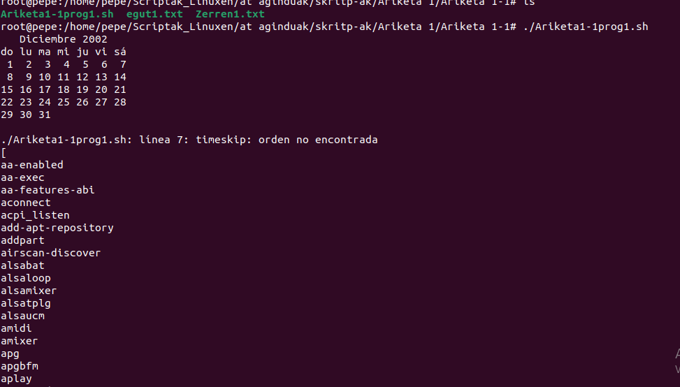

## At aginduak
****
- [Ariketa 1](#ariketa-1)
- [at komandoa.](#at-komandoa)
- [atq komandoa.](#atq-komandoa)
- [atrm komandoa.](#atrm-komandoa)
- [Ariketa 2](#ariketa-2)
- [Ariketa 3](#ariketa-3)
- [Ariketa 4](#ariketa-4)
- [Ariketa 5](#ariketa-5)
- [Ariketa 6](#ariketa-6)
- [Ariketa 7](#ariketa-7)
- [Ariketa 8](#ariketa-8)
- [Ariketa 9](#ariketa-9)
- [Ariketa 10](#ariketa-10)

***
# Ariketa 1
***
 Sortu hiru programa hauek zure erabiltzaile-kontutik:

 1. prog1:

    1.1 Bideratu 2002ko abenduko egutegia karpeta partekatutako egut1 fitxategira. 

     1.2 Zerrendatu era luzean /bin direktorioaren barruko fitxategiak eta direktorioak, karpeta partekatutako zerren1 fitxategian. 

2. prog2: 

   2.1 Bideratu 2004ko ekaineko egutegia karpeta partekatutako egut2 fitxategira. 

   2.2 Zerrendatu era luzean erroaren direktorioak eta fitxategiak, karpeta partekatutako zerren2 fitxategian. 

3. prog3: 

   3.1 Bideratu 2005eko urtarrileko egutegia karpeta partekatutako egut3 fitxategira. 

   3.2 Zerrendatu era luzean kanpoko fitxategi-sistemak muntatzen diren direktorioaren edukia, karpeta partekatutako zerren3 fitxategian. 

   3.3 Bihurtu exekutagarri sortu berri dituzun hiru fitxategi horiek.

***
# at komandoa.
*** 
Prozesu bat ordu eta egun jakin batean exekutatzeko erabiltzen da. 

at komandoaren sintaxia honako hau da: at [-q lan-zerrenda] -f skripta ordua 

at komandoaren sintaxia honako hau da: at [-q lan-zerrenda] -f skripta ordua 

[-q lan-zerrenda] > letra bakarreko lan-zerrenda zehaztu daiteke. Ez da beharrezkoa. 

Ordua finkatzeko: 

OO:MM formatuan idazten da. 
AM, PM ez dira beharrezkoak. 

Egunik eta ordurik zehaztu ezean, gaurko eguna hartzen da. 
Egunak zehazteko era bat baino gehiago dago: HHEEUU, HH/EE/UU. 
Ordu jakinak zehazteko: MIDNIGHT, TODAY, TOMORROW, NOW, NEXT erabil daitezke. 
Ordu-mugimenduak erabil daitezke, hala nola +MINUTES, HOURS, DAYS, WEEKS, MONTHS, YEARS. 

Adibideak:
at –f skript1 11:20 
at –f skript2 11:20PM 
at –f skript3 06:00AM 08/21/04 
at –f skript4 09:15AM 08.21.04 
at –f script5 now + 15 minutes 
at –q D –f skript6 now + 2 minutes

Lan-zerrendak: at komandoaren bidez planifikatutako lanak lan-zerrendatan gordetzen dira.
***
# atq komandoa. 
***
at komandoaren bidez planifikatutako lanak zerrendatzeko erabiltzen da. 

atq komandoaren sintaxia honako hau da: 

atq [-q lan-zerrenda]
atq erabiltzailearen lan-zerrenda guztien lanak zerrendatu. 
atq -q D D lan-zerrendaren lanak zerrendatu. 
***
# atrm komandoa. 
***
Lan-zerrendan finkaturiko lanak zerrendatik ezabatzeko erabiltzen da. 

1. at –d lana_zb: komandoaren baliokidea da. atrm komandoaren sintaxia honako hau da: atrm lan_zb1 [lan_zb2] [lan_zb3]

atrm 1 lan_zb 1 duen lana zerrendatik kentzen du. 
atrm 1 3 4 8 lan_zb 1,3,4,8 duten lanak zerrendatik kentzen ditu. 

at komandoa erabiltzeko honako baldintza hauek bete behar dira: 

rootek beti erabil dezake.
/etc/at.allow fitxategia badago, bertan agertzen diren erabiltzaileek erabil dezakete.
/etc/at.allow fitxategia badago baina hutsik badago, rootek baino ezin erabil dezake.
/etc/at.allow fitxategirik izan ezean, /etc/at.deny fitxategian agertzen ez diren erabiltzaileek erabil dezakete. 
/etc/at.deny fitxategia badago baina hutsik badago, eta /etc/at.allow ez badago, edozein erabiltzailek erabil dezake.
/etc/at.deny eta /etc/at.allow fitxategiak ez badaude, edozein erabiltzailek erabil dezake. 
***
# Ariketa 2 
Frogatu at komandoa erabiltzeko baimenik duzun ala ez. 

***
# Ariketa 3 
prog1 5 minutu barru exekuta dadin, bidali D lan-zerrendara. 

***
# Ariketa 4 
prog2 10 minutu barru exekuta dadin (ordua zehaztu), bidali L lanzerrendara. 

***
# Ariketa 5 
Exekutarazi prog3, bihar arratsaldeko 15:00etan. 

***
# Ariketa 6 
Zerrendatu D lan-zerrendan dauden lanak 
***
# Ariketa 7 
Zerrendatu lan-zerrendetan dauden lanak. 

***
# Ariketa 8 
Ezabatu bihar exekutatu beharreko lana. 

***
# Ariketa 9 
Denbora igaro ondoren, frogatu exekutatu beharreko lanak exekutatu direla. 

***
# Ariketa 10 
urko kontua /etc/at.deny fitxategian sartu ondoren, exekutarazi prog3 urko kontutik, hiru minutu pasatu ondoren.

